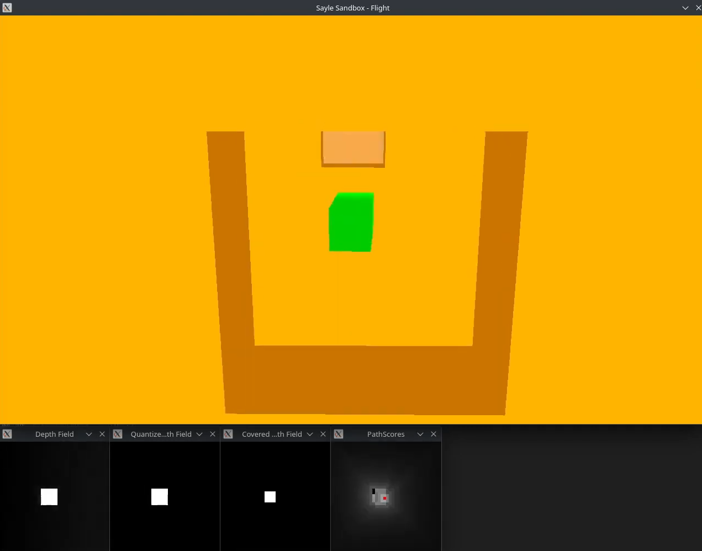

# Sayle - Flightbot Simulation

    

This is a randomized terrain visualization, with a bot flying through it avoiding collisions.
This project is discontinued and will not be maintained.

## Installation

### Direct Method

1. Ensure you have JDK 17 and Maven installed.
2. Run `mvn clean install` to build the project.
3. Run `mvn exec:java` to run the simulation.

### Using Nix Flakes

1. Run `nix build` to build the project.
2. Run `./result/bin/sayle` to run the simulation.